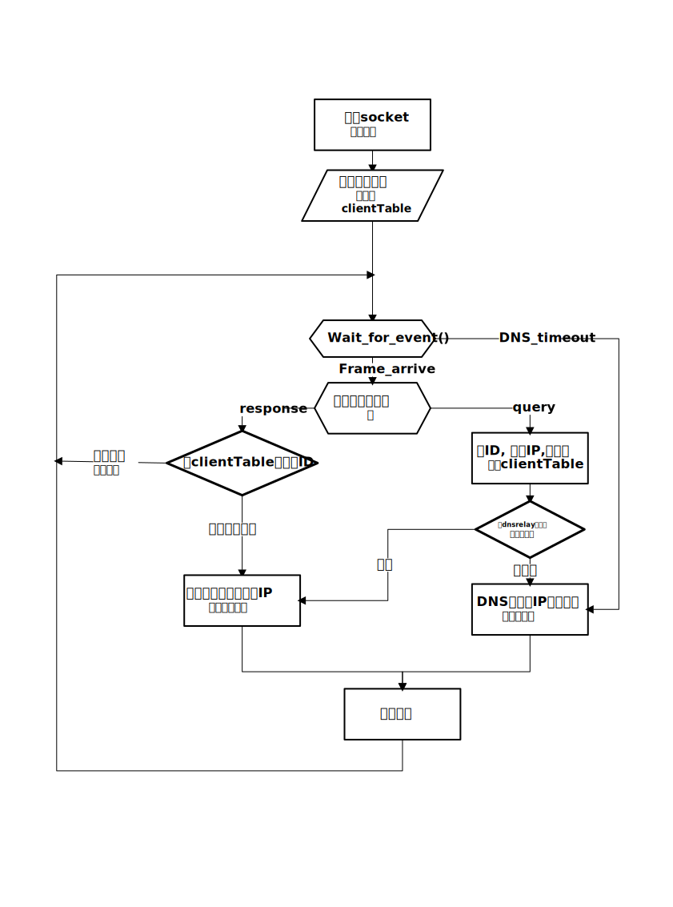

<<<<<<< HEAD
# DNS-Relay ―― DNS中继器
## 1. 框架

## 2. 编码规范
* 变量名: `yourFather`
* 函数名: `YourFather`
* 文件名: `your_father`
* 不要在`.h`文件里面声明任何变量
* 结构体声明放在`.h`中
* 所有的全局变量都用`static`修饰,需要访问的话提供接口
* 不需要被外部调用的函数不用在`.h`中声明,只需要在`.cpp`中用`static`修饰定义
* 所有的外部函数(被其他模块的调用的函数)必须加`extern`,(虽然这个`extern`没有什么意义);
* 所有表示一个字节的内存区必须使用`unsigned char`
* `include`全部放在`.h`文件吧,防止重复定义
* 注释统一使用 `/* ... */` 不要用`//`
* else 不换行, 记得在格式化设置里面调好。
## 3. 接口说明
=======
# DNS-Relay �����?DNS涓�缁у�?
## 1. 妗����

## 2. 缂����瑙����
* ��������? `yourFather`
* ��芥�板�? `YourFather`
* ���浠跺�? `your_father`
* 涓�瑕����`.h`���浠堕����㈠０���浠讳��������
* 缁����浣�澹版����惧��`.h`涓?
* �����������ㄥ����������界��`static`淇�楗�,���瑕�璁块�����璇����渚���ュ�?
* 涓����瑕�琚�澶���ㄨ����ㄧ����芥�颁����ㄥ��`.h`涓�澹版�?������瑕����`.cpp`涓����`static`淇�楗板��涔�
* ���������澶���ㄥ�芥��(琚���朵��妯″�����璋���ㄧ����芥�?蹇�椤诲��`extern`,(��界�惰��涓�`extern`娌℃��浠�涔����涔?;
* ������琛ㄧず涓�涓�瀛����������瀛���哄��椤讳娇���`unsigned char`
* `include`��ㄩ�ㄦ�惧��`.h`���浠跺�?��叉�㈤��澶�瀹�涔�
* 娉ㄩ��缁�涓�浣跨�� `/* ... */` 涓�瑕����`//`
* else 涓���㈣�? 璁板����ㄦ�煎�����璁剧疆�����㈣��濂姐�?
## 3. ��ュ�ｈ�存��
>>>>>>> 977e2d94c133cc845dfa304a76e019622d61648a
