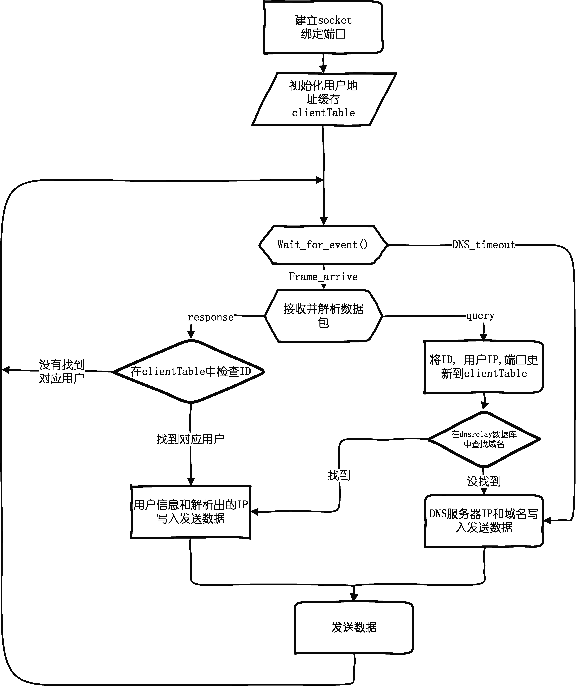

# DNS-Relay —— DNS中继器
## 1. 框架

## 2. 编码规范
* 变量名: `yourFather`
* 函数名: `YourFather`
* 文件名: `your_father`
* 不要在`.h`文件里面声明任何变量
* 结构体声明放在`.h`中
* 所有的全局变量都用`static`修饰,需要访问的话提供接口
* 不需要被外部调用的函数不用在`.h`中声明,只需要在`.cpp`中用`static`修饰定义
* 所有的外部函数(被其他模块的调用的函数)必须加`extern`,(虽然这个`extern`没有什么意义);
* 所有表示一个字节的内存区必须使用`unsigned char`
* `include`全部放在`.h`文件吧,防止重复定义
* 注释统一使用 `/* ... */` 不要用`//`
* else 不换行, 记得在格式化设置里面调好。
## 3. 接口说明
## 4. 结构体设计
### [1] clientRecord
```C
typedef struct {
	SOCKADDR addr;
	DNSID originId;
	unsigned char r;
}CRecord;
``` 
### [2] clientTable
```C
typedef struct {
	CRecord base[MAX_QUERIES];
	int front;
	int rear;
}CQueue;
```
### [3] DNSHeader(待完善)
```C
typedef struct dnsheader{
	unsigned short ID;		
	unsigned short FLAGS;	/*2字节的各种flag*/
	unsigned short QDCOUNT;	
	unsigned short ANCOUNT;
	unsigned short NSCOUNT;
	unsigned short ARCOUNT;
}DNSHeader;
```
* 由多个`clientRecord`组成的队列，循环数组。
* 服务器最多支持MAX_QUERY个请求同时等待。队列满了之后丢弃新包。
* 每次收到一个来自客户端的query报文时。
  * 将客户端地址和报文ID入队。
  * 如果入队成功,调用获取队尾元素序号,作为转发DNS的ID发送给服务器。
* 每次收到一个response时。
  * 在队列中查找对应ID的query是否未回复。
  * 如果未回复,则回复并将r置为1。
  * 并且把这个DNS发回给客户端。  
* 每次检查计时器时。
  * 从队头开始检查。
  * 如果已经回复,则将其pop出来。
  * 如果超时,则将其pop出来重新加入队列并发送。
  * 如果没有超时并且r=0,则停止检查。

## 5. 待解决问题
* 如何处理0.0.0.0的记录？
* 字节序:超过一个字节长度的字段,字节之间的顺序相反。
